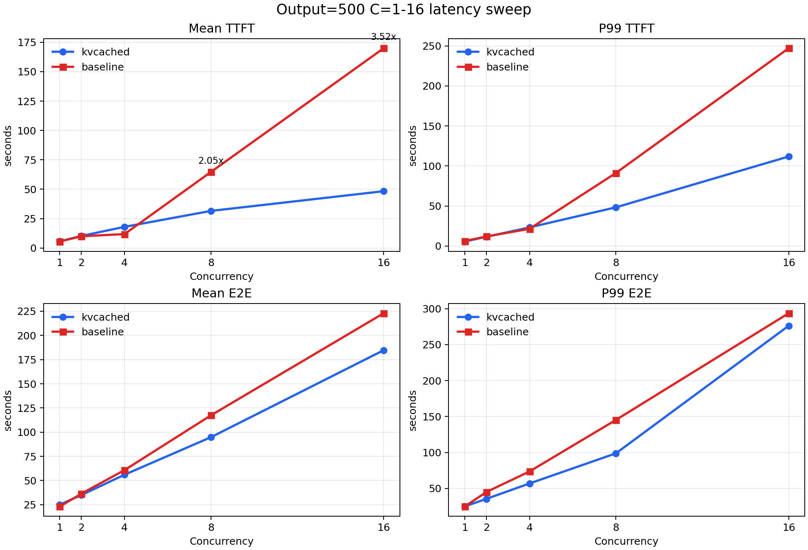
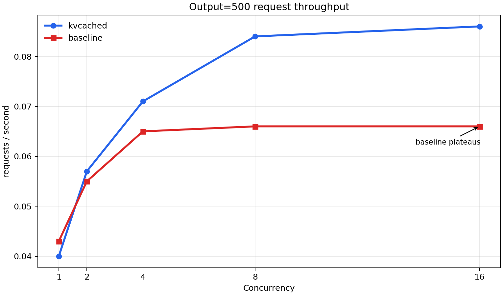
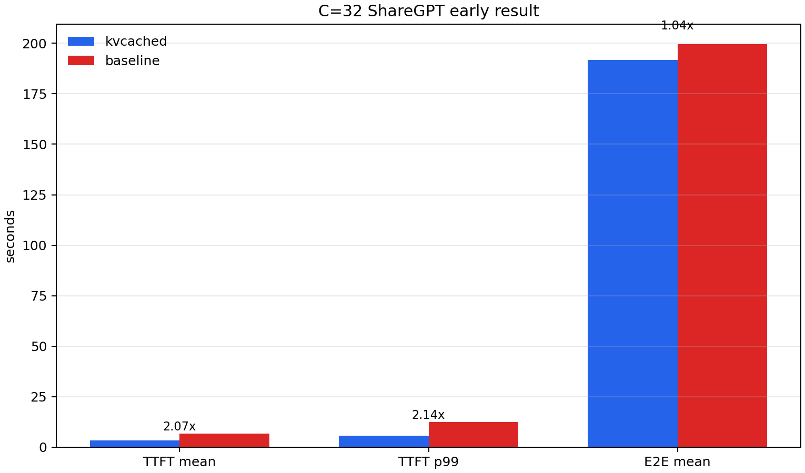
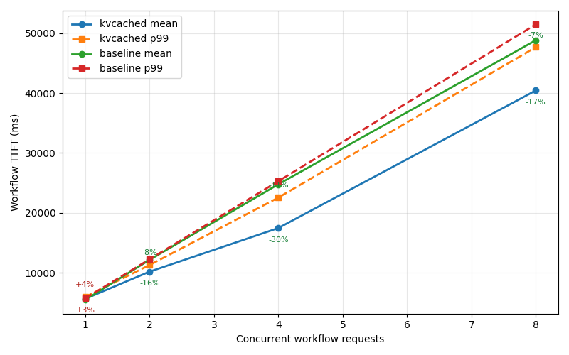
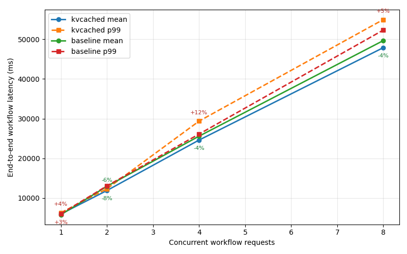
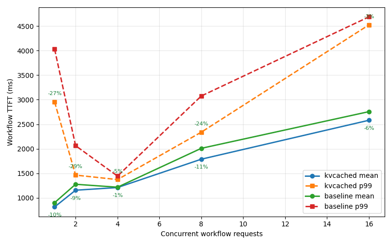
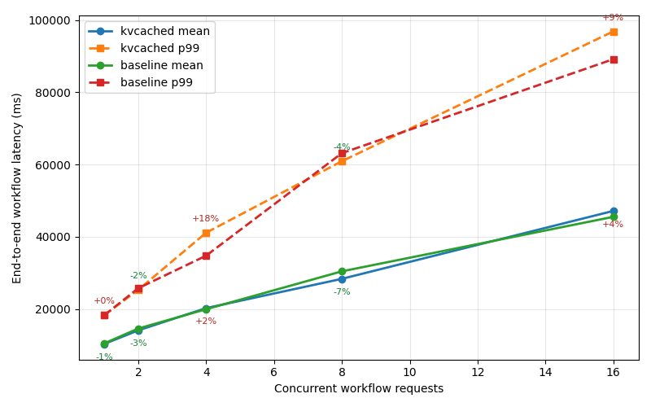
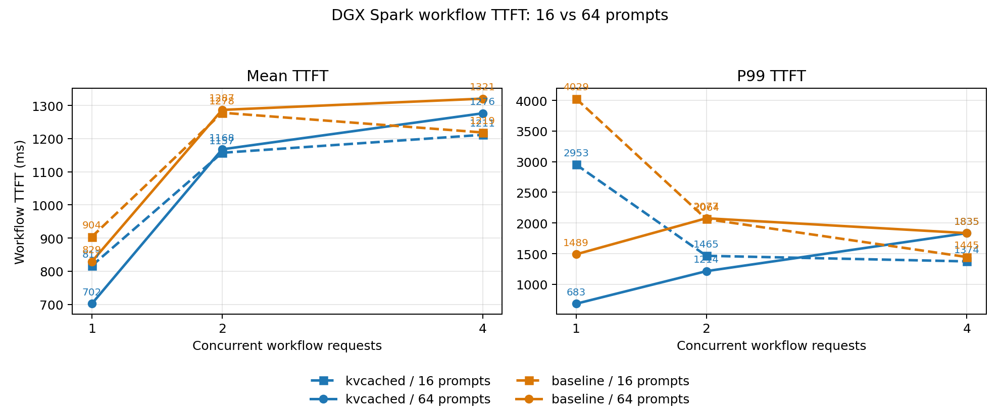

# DGX Spark Demo

## Hardware

| Component | Spec |
|-----------|------|
| System | NVIDIA DGX Spark |
| GPU | NVIDIA GB10 (128 GB unified CPU/GPU memory) |
| CUDA | 13.0 |
| Driver | 580.126.09 |

## Software

| Component | Version / Detail |
|-----------|-----------------|
| vLLM | 0.19.2.dev0 (custom build with kvcached patches) |
| kvcached | from source (`main` branch) |
| Python | 3.12 (conda env `kvcached`) |

## Models

| Role | Model | Params | Weights (BF16) | KV/token |
|------|-------|--------|----------------|----------|
| Main LLM, Experiment 1 | `Qwen/Qwen3.6-35B-A3B` | 35B total / 3B active (MoE) | ~67 GB | 20 KiB |
| Main LLM, Experiment 2 | `Qwen/Qwen3-30B-A3B` | 30B total / 3B active (MoE) | ~57 GB | 96 KiB |
| Guardrail | `meta-llama/Llama-Guard-3-8B` | 8B | ~15 GB | 128 KiB |

## Results

### Qwen3-30B-A3B Output=500 C=1-16 Sweep

Same Guard -> Main workflow with ~12K input, 500 output
tokens, and 64 prompts per concurrency level.  kvcached uses
`main=0.75, guard=0.30`; baseline launches guard first with
`main=0.49, guard=0.31`.

Latency speedup is `baseline / kvcached`.  Throughput speedup is
`kvcached / baseline`.

| C | Mean TTFT speedup | P99 TTFT speedup | Mean E2E speedup | P99 E2E speedup | Throughput speedup |
|--:|------------------:|-----------------:|-----------------:|----------------:|-------------------:|
| 1 | 0.98x | 1.10x | 0.92x | 0.99x | 0.93x |
| 2 | 0.97x | 1.03x | 1.04x | 1.27x | 1.04x |
| 4 | 0.66x | 0.92x | 1.09x | 1.29x | 1.09x |
| 8 | 2.05x | 1.89x | 1.24x | 1.47x | 1.27x |
| 16 | 3.52x | 2.21x | 1.21x | 1.06x | 1.30x |

| Latency vs Concurrency | Throughput vs Concurrency |
|:---:|:---:|
|  |  |

The turning point is C=8: baseline main KV cache starts waiting, while
kvcached continues to admit the full batch.  By C=16, mean TTFT speedup reaches
3.52x and throughput speedup reaches 1.30x.

### Qwen3.6-35B-A3B ShareGPT C=32 Early Result

This older run uses a different main model and ShareGPT
inputs, so it is useful as a reference point rather than a direct comparison
with the Qwen3-30B output=500 sweep.

| Metric | kvcached | baseline | Speedup |
|--------|---------:|---------:|--------:|
| workflow TTFT mean | 3.28s | 6.80s | 2.07x |
| workflow TTFT p99 | 5.83s | 12.50s | 2.14x |
| E2E mean | 191.69s | 199.58s | 1.04x |



### Experiment 5: Qwen3-30B-A3B C=8 Decode-Length Sweep

Same Guard -> Main workload as Experiment 2, with `BENCH_INPUT_LEN=8192`,
`NUM_PROMPTS=64`, and C=8.  The main comparison uses kvcached
`main=0.75, guard=0.30` and baseline guard-first `main=0.49, guard=0.31`.
Speedup is `baseline / kvcached`; values above 1.0 mean kvcached is faster.

| Output cap | kvcached result | baseline result | Mean TTFT speedup | P99 TTFT speedup | Mean E2E speedup | P99 E2E speedup | Baseline main waiting | Note |
|-----------:|-----------------|-----------------|------------------:|-----------------:|-----------------:|----------------:|-----------------------|------|
| 500 | `results_gain_12k_c8_out500_m049_g031/` | same dir | 2.04x | 1.83x | 1.24x | 1.43x | yes, max 4 | TTFT and E2E improve |
| 1,000 | `results_gain_12k_c8_out1k_m065_g019/` | `results_gain_12k_c8_out1k_m049_g031/` | 1.86x | 1.98x | 0.91x | 1.18x | yes, max 4 | TTFT improves; E2E mixed |
| 2,000 | `results_gain_12k_c8_out2k_m049_g031/` | same dir | 2.11x | 1.87x | 0.51x | 0.63x | yes, max 4 | TTFT improves; E2E worse |

Raw latency:

| Output cap | kvcached mean TTFT (s) | baseline mean TTFT (s) | kvcached P99 TTFT (s) | baseline P99 TTFT (s) | kvcached mean E2E (s) | baseline mean E2E (s) | kvcached P99 E2E (s) | baseline P99 E2E (s) |
|-----------:|-----------------------:|-----------------------:|----------------------:|----------------------:|----------------------:|----------------------:|---------------------:|---------------------:|
| 500 | 31.84 | 64.93 | 51.46 | 94.15 | 95.14 | 118.02 | 101.84 | 146.06 |
| 1,000 | 31.65 | 58.93 | 49.84 | 98.65 | 141.16 | 128.14 | 145.94 | 171.51 |
| 2,000 | 31.76 | 66.86 | 52.25 | 97.56 | 239.59 | 121.54 | 245.88 | 156.09 |

Baseline split checks for output=1,000:

| Baseline main util | Baseline guard util | Outcome | Mean TTFT speedup | Mean E2E speedup | Main waiting |
|-------------------:|--------------------:|---------|------------------:|-----------------:|--------------|
| 0.65 | 0.19 | cannot launch both models | - | - | - |
| 0.62 | 0.19 | completes, not memory-bound | 0.49x | 0.77x | no |
| 0.50 | 0.31 | startup free-memory check failed | - | - | - |
| 0.49 | 0.31 | completes, memory-bound | 1.86x | 0.91x | yes, max 4 |

### Experiment 3: Qwen3-30B-A3B C=16 Baseline Split Sweep

```
User request  -->  Guardrail (input check)  -->  LLM  -->  Response
```

| Parameter | Value |
|-----------|-------|
| Main model | `Qwen/Qwen3-30B-A3B` |
| Guard model | `meta-llama/Llama-Guard-3-8B` |
| Dataset | Synthetic random prompts (`DATASET_NAME=random`) |
| `BENCH_INPUT_LEN` | 8,192 word target, about 11.6K tokens with the Qwen3-30B tokenizer |
| Main output cap | 10 tokens |
| `max-model-len` | 16,384 for both models and both modes |
| Concurrency level | 16 |
| Prompts | 128 |
| Baseline util sum | 0.81 |

Common kvcached reference:

| Mode | Main util | Guard util | Completed | Failed | Mean TTFT (s) | P99 TTFT (s) | Mean E2E (s) | P99 E2E (s) |
|------|----------:|-----------:|----------:|-------:|--------------:|-------------:|-------------:|------------:|
| kvcached | 0.75 | 0.30 | 128 | 0 | 85.61 | 99.35 | 94.39 | 108.34 |

Baseline sweep:

| Main util | Guard util | Main 16K capacity | Guard 16K capacity | Outcome | Mean TTFT (s) | TTFT speedup | Mean E2E (s) | E2E speedup |
|----------:|-----------:|------------------:|-------------------:|---------|--------------:|-------------:|-------------:|------------:|
| 0.50 | 0.31 | 2.26x | - | guard startup CUDA OOM | - | - | - | - |
| 0.53 | 0.28 | 4.58x | - | guard startup CUDA OOM | - | - | - | - |
| 0.55 | 0.26 | 5.25x | - | guard startup CUDA OOM | - | - | - | - |
| 0.57 | 0.24 | 7.18x | 6.66x | completed | 89.54 | 1.05x | 93.79 | 0.99x |
| 0.60 | 0.21 | 10.35x | - | guard startup CUDA OOM | - | - | - | - |

The best completed baseline split in this sweep is `main=0.57, guard=0.24`.
It gives `1.05x` mean TTFT speedup for kvcached vs. baseline at C=16.

### Experiment 4: Qwen3-30B-A3B C=16 Guard-First Boundary

Same workload and kvcached reference as Experiment 3.  Baseline launches the
guard model first, fixes `guard=0.31`, and sweeps runnable main util values.
Speedup is `baseline / kvcached`; values above 1.0 mean kvcached is faster.

| Main util | Guard util | Completed | Failed | Main 16K capacity | Guard 16K capacity | Mean TTFT (s) | TTFT speedup | Mean E2E (s) | E2E speedup |
|----------:|-----------:|----------:|-------:|------------------:|-------------------:|--------------:|-------------:|-------------:|------------:|
| 0.47 | 0.31 | 128 | 0 | 1.44x | 10.68x | 88.52 | 1.034x | 93.57 | 0.991x |
| 0.48 | 0.31 | 128 | 0 | 1.95x | 10.66x | 88.23 | 1.031x | 93.47 | 0.990x |
| 0.50 | 0.31 | 128 | 0 | 3.72x | 10.65x | 87.89 | 1.027x | 92.92 | 0.984x |

The lower tested boundary is between `main=0.46` and `main=0.47`: `0.45` and
`0.46` load the main model but fail vLLM's 16K KV-capacity check.  Under the
fixed util sum of `0.81`, `main=0.50, guard=0.31` is the highest tested split
and completed on rerun.

### Experiment 2: Qwen3-30B-A3B 12K Guard -> Main

```
User request  -->  Guardrail (input check)  -->  LLM  -->  Response
```

| Parameter | Value |
|-----------|-------|
| Main model | `Qwen/Qwen3-30B-A3B` |
| Guard model | `meta-llama/Llama-Guard-3-8B` |
| Dataset | Synthetic random prompts (`DATASET_NAME=random`) |
| `BENCH_INPUT_LEN` | 8,192 word target, about 11.6K tokens with the Qwen3-30B tokenizer |
| Main output cap | 10 tokens |
| `max-model-len` | 16,384 for both models and both modes |
| Concurrency levels | 1, 2, 4, 8 |
| Prompts per level | 64 |
| Timeout per level | 2,400 s |

Configuration:

| Mode | Main `gpu-memory-utilization` | Guard `gpu-memory-utilization` |
|------|-------------------------------|--------------------------------|
| kvcached | 0.75 | 0.30 |
| baseline | 0.59 | 0.15 |

Observed KV capacity at startup:

| Mode | Model | Available KV cache | 16,384-token concurrency |
|------|-------|--------------------|--------------------------|
| kvcached | Guard | 19.69 GiB | 9.84x |
| baseline | Main | 13.04 GiB | 8.69x |
| baseline | Guard | 2.54 GiB | 1.27x |

#### End-to-end metrics

Speedup is `baseline / kvcached`; values above 1.0 mean kvcached is faster.

| Concurrency | kvcached mean TTFT (s) | baseline mean TTFT (s) | TTFT speedup | kvcached P99 TTFT (s) | baseline P99 TTFT (s) | P99 speedup | kvcached mean E2E (s) | baseline mean E2E (s) | E2E speedup |
|------------:|-----------------------:|-----------------------:|-------------:|----------------------:|----------------------:|------------:|----------------------:|----------------------:|------------:|
| 1 | 5.65 | 5.47 | 0.97x | 5.96 | 5.72 | 0.96x | 6.00 | 5.82 | 0.97x |
| 2 | 10.18 | 12.16 | 1.19x | 11.29 | 12.26 | 1.09x | 11.91 | 12.97 | 1.09x |
| 4 | 17.47 | 24.78 | 1.42x | 22.55 | 25.29 | 1.12x | 24.61 | 25.59 | 1.04x |
| 8 | 40.44 | 48.83 | 1.21x | 47.68 | 51.48 | 1.08x | 47.87 | 49.65 | 1.04x |

#### Stage breakdown

| Concurrency | kvcached guard mean (s) | baseline guard mean (s) | Guard speedup | kvcached main TTFT mean (s) | baseline main TTFT mean (s) | Main TTFT speedup |
|------------:|------------------------:|------------------------:|--------------:|----------------------------:|----------------------------:|------------------:|
| 1 | 2.95 | 2.92 | 0.99x | 2.70 | 2.55 | 0.94x |
| 2 | 5.86 | 6.60 | 1.13x | 4.32 | 5.56 | 1.29x |
| 4 | 10.71 | 19.22 | 1.79x | 6.76 | 5.56 | 0.82x |
| 8 | 33.53 | 43.28 | 1.29x | 6.92 | 5.56 | 0.80x |

#### Figures

| TTFT vs Concurrency | End-to-End Latency vs Concurrency |
|:---:|:---:|
|  |  |

### Experiment 1: Qwen3.6-35B-A3B Guard -> Main -> Guard

```
User request  -->  Guardrail (input check)  -->  LLM  -->  Guardrail (output check)  -->  Response
```

Important configuration:

| Parameter | Value |
|-----------|-------|
| Main model | `Qwen/Qwen3.6-35B-A3B` |
| Guard model | `meta-llama/Llama-Guard-3-8B` |
| Dataset | Synthetic random prompts (`DATASET_NAME=random`) |
| Input length | `random-input-len=256`, about 400 prompt tokens |
| Main output cap | 2,048 tokens |
| `max-model-len` | kvcached main 65,536; baseline main 8,192; guard 8,192 |
| Concurrency levels | 1, 2, 4, 8, 16 |
| Prompts per level | 16 for C=1/2/4/8; 32 for C=16 |

Memory split:

| Mode | Main `gpu-memory-utilization` | Guard `gpu-memory-utilization` |
|------|-------------------------------|--------------------------------|
| kvcached | 0.70 | 0.25 |
| baseline | 0.65 | 0.16 |

#### Summary Table

| Mode | Concurrency | Completed | Mean TTFT (ms) | P99 TTFT (ms) | Mean E2E (ms) | P99 E2E (ms) |
|------|:-----------:|:---------:|:--------------:|:-------------:|:-------------:|:------------:|
| kvcached | 1 | 16 | 817 | 2,953 | 10,349 | 18,311 |
| kvcached | 2 | 16 | 1,157 | 1,465 | 14,102 | 25,317 |
| kvcached | 4 | 16 | 1,211 | 1,374 | 20,260 | 41,128 |
| kvcached | 8 | 16 | 1,789 | 2,339 | 28,363 | 60,923 |
| kvcached | 16 | 32 | 2,581 | 4,524 | 47,163 | 96,843 |
| baseline | 1 | 16 | 904 | 4,029 | 10,503 | 18,301 |
| baseline | 2 | 16 | 1,278 | 2,064 | 14,614 | 25,763 |
| baseline | 4 | 16 | 1,219 | 1,445 | 19,957 | 34,770 |
| baseline | 8 | 16 | 2,010 | 3,076 | 30,441 | 63,146 |
| baseline | 16 | 32 | 2,757 | 4,687 | 45,526 | 89,155 |

#### Figures

| TTFT vs Concurrency | End-to-End Latency vs Concurrency |
|:---:|:---:|
|  |  |

#### 64-prompt TTFT check



## File Inventory

```
benchmarks/bench_dgx_spark
├── README.md                 # this file
├── config.sh                 # shared configuration (models, ports, tuning knobs)
├── launch_main.sh            # start main LLM (--mode kvcached|baseline)
├── launch_guard.sh           # start guardrail model (--mode kvcached|baseline)
├── bench.sh                  # concurrency sweep (Guard -> LLM -> Guard)
├── workflow_benchmark.py     # Python harness for the full pipeline benchmark
├── plot_results.py           # generate comparison plots from results/
├── run_benchmark.sh          # end-to-end: launch + bench + stop
├── stop.sh                   # kill all vllm serve processes
├── results/
│   ├── kvcached/             # per-concurrency JSON results
│   ├── baseline/             # per-concurrency JSON results
│   ├── summary.csv           # combined metrics table
│   ├── ttft_vs_concurrency.png
│   └── e2e_vs_concurrency.png
├── results_np64/
│   ├── summary.csv           # 64-prompt C=1/2/4 check
│   └── ttft_np16_vs_np64.png # TTFT comparison for 16 vs 64 prompts
├── results_gain_12k_c8_tuned/
│   ├── summary.csv           # Qwen3-30B-A3B 12K guard->main run
│   ├── kvcached/             # C=1/2/4/8 JSON results
│   ├── baseline/             # C=1/2/4/8 JSON results
│   ├── ttft_vs_concurrency.png
│   └── e2e_vs_concurrency.png
└── results_gain_12k_c16_sweep/
    ├── summary_c16_sweep.csv # baseline split sweep summary
    ├── kvcached/             # C=16 reference JSON result
    ├── m050_g031/            # failed baseline split: guard startup OOM
    ├── m053_g028/            # failed baseline split: guard startup OOM
    ├── m055_g026/            # failed baseline split: guard startup OOM
    ├── m057_g024/            # completed baseline split result
    └── m060_g021/            # failed baseline split: guard startup OOM
```
