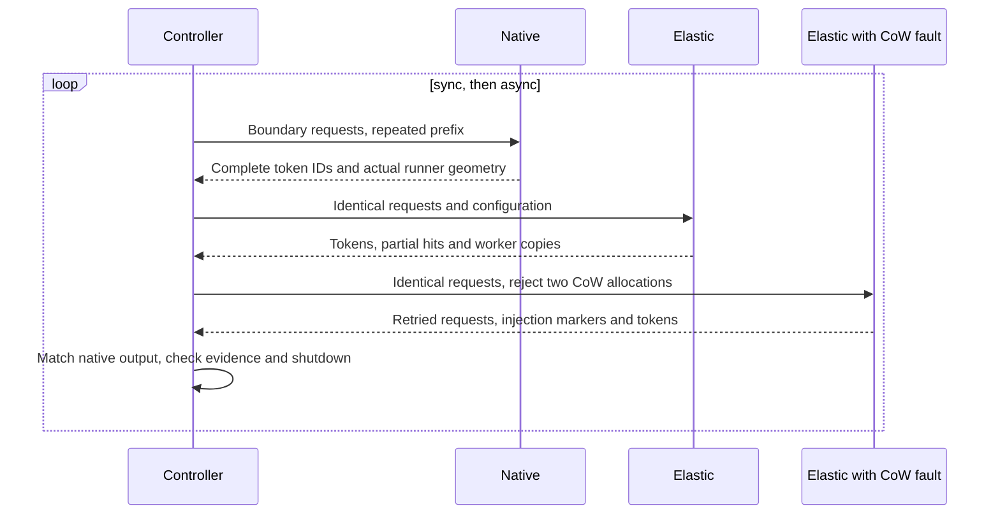

# vLLM release compatibility workflow

This workflow detects stable vLLM releases, prepares a bounded compatibility
repair, validates it on a separate GPU host, and publishes a PR for human review.
It does not merge changes or certify every supported model and GPU topology.

## Execution flow

1. An hourly poll selects the oldest unseen stable release at or above the
   configured starting version. Manual dispatch can select an exact tag.
2. The detector pins the upstream commit and claims the release/profile pair in a tracker
   issue. Successful, failed, interrupted and no-change runs remain recorded.
   The candidate starts at the PR target's pinned default branch, not the branch
   used to dispatch the controller workflow.
3. A CPU job runs immutable behavioral probes and, when needed, invokes the
   bounded repair runner. Passing CPU probes still produces a candidate for GPU
   validation; it is not a reason to skip that stage.
4. A dedicated GPU runner independently reconstructs the candidate, builds it,
   and runs the GPU probe. It has no Codex credentials.
5. A behavioral GPU failure can trigger one additional CPU/GPU round. The CPU
   job verifies that the report belongs to this candidate and upstream commit.
   Infrastructure failures stop the run instead of asking the agent to fix code.
6. A passing candidate runs the complete CPU suite, MyPy on Python 3.9 through
   3.13, pre-commit, and GPU-free C++ tests in fresh hosted workers.
7. A separate publisher reconstructs exactly the tested commit and creates a PR.
   Existing human branch changes are never overwritten. Unchanged candidates
   produce a successful report without an empty PR. Publication is complete only
   after the PR identity, mergeability and remote checks for that SHA are verified.

Each CPU round permits one Codex attempt. There are at most two CPU/GPU rounds.
Manual dispatch defaults to `mode=validate`: run the independent checks against
the unchanged baseline, then GPU checks and full CI. This mode neither installs
nor invokes Codex, does not retry a behavioral failure, and cannot publish a PR.
Use it to qualify merged adapters without duplicating pending manual work.
Scheduled runs retain the bounded `repair` mode; enabling schedules is a separate
operator decision, not a side effect of running validation.
GitHub's rerun button is deliberately disabled for this workflow: start a new
manual dispatch with a tag and `retry=true` to obtain a new explicit budget.
An interrupted claim is retained until that explicit retry; polling does not
silently spend another repair budget.

The next hourly poll discovers releases missed while another run was executing.
The `release` event on this repository cannot observe releases in the separate
vLLM repository, so it is not used here.

## Enable the workflow

Enable only after an operator has validated the chosen execution environments.
No registration, credential copying or upstream setting changes happen merely
by merging these files.

| Setting | Purpose |
| --- | --- |
| `VLLM_RELEASE_COMPAT_ENABLED` | Set to `true` to enable discovery. Unset by default. |
| `VLLM_RELEASE_TRACKER_ISSUE` | Number of a dedicated tracker issue in the workflow repository. |
| `VLLM_COMPAT_FIRST_VERSION` | Oldest release to process; defaults to `0.28.0`. |
| `VLLM_COMPAT_PUBLISH_REPOSITORY` | Branch destination, normally an automation fork. |
| `VLLM_COMPAT_PR_REPOSITORY` | Repository receiving the PR. Defaults to the workflow repository. |
| `VLLM_COMPAT_IMAGE` | Optional operator-maintained runtime image; its installed vLLM version must match the selected release. |
| `ENGINE_COMPAT_CODEX_API_KEY` | Secret used only by the CPU repair job. |
| `ENGINE_COMPAT_PUBLISH_TOKEN` | Dedicated publication credential, never supplied to candidate execution. |

The tracker issue body must contain this exact marker:

```text
<!-- kvcached-vllm-release-tracker -->
```

Use a token that can update the selected fork and open the target PR. The normal
workflow `GITHUB_TOKEN` is intentionally not used for publication: its generated
events do not generally start another workflow. Keep the published PR's normal
CI and review requirements enabled. The pipeline performs the full applicable
validation before publication; remote PR checks still confirm the published SHA.
If the target branch advances during validation, the publisher stops and asks
for a new validated run rather than silently rebasing the candidate.

Register an isolated Linux x64 GPU runner with the `engine-compat-gpu` label.
It needs Python 3.9+, Git, Docker with GPU support and a compatible host driver.
Do not register a shared production inference host or a developer's everyday
workstation under that label. A dedicated/ephemeral runner is the intended
deployment, and it must be able to reach GitHub and obtain the runtime image.

The default image is `vllm/vllm-openai:<release-tag>`; its resolved image ID is
recorded for the run. Missing images, incompatible drivers and occupied GPUs are
infrastructure failures. A custom image is useful for an approved CUDA variant,
but does not allow testing one vLLM version while reporting another.

## Select a bounded task

Manual dispatch accepts a reviewed `profile`; scheduled runs use `vllm`.
The task text, exact write allowlist and independent checks are owned by the
controller revision, not supplied by an issue comment or the repair agent.

| Profile | Repair scope | Independent acceptance |
| --- | --- | --- |
| `vllm` | Worker profiling and warmup | Memory-contract tests, matched single-GPU output and CUDA OOM recovery |
| `native-layout` | Native 0.29 MRV2 allocator and views | Installed-engine view tests, then the single-GPU probe |
| `allocation` | 0.29 scheduling-miss translation and block lifetimes | CPU failure/ownership contracts, installed-engine block-pool tests, then the single-GPU probe |
| `attention-v1-028` | Validation only, no repair | 0.28 worker contracts and native/patched tiny attention outputs; V1, both elastic layouts |
| `attention-v2-028` | Validation only, no repair | Same narrow attention checks; explicitly selected and verified V2, both elastic layouts |
| `hybrid-v1-028` | Validation only, no repair | 0.28 V1 tiny dense hybrid, partial-prefix state copying and two real CoW allocation misses; sync and async |
| `hybrid-v2-029` | Validation only, no repair | The same hybrid acceptance with the 0.29 MRV2 runner |

For example, `--profile native-layout` selects the same scope in local CPU,
GPU and publication stages. Each stage verifies the profile name and a digest
of its policy, trusted tests, probe helpers and model fixture. Evidence from another task or an older
policy cannot authorize a retry or publication. Nondefault profiles publish to
separate task-suffixed branches. The tracker keeps separate records per release
and profile: a profiling pass must not suppress layout or allocation checks.
Historical records without a profile belong only to `vllm`. Only rerunning the
same release/profile requires `retry=true`; another profile gets its own claim.
Changing the candidate baseline still requires an explicit retry of that pair.

The native profiles currently require a 0.29 release. A different release is
rejected before claiming it or spending a repair attempt; its trusted contracts
must first be updated by a reviewed controller change. The repair agent cannot
make an incompatible immutable test pass by editing the candidate's copy.

Each required test file runs in an independent pytest process. The evidence
records its command, exit status, test count, failures, errors and skips. Empty
collection, a skipped contract, or an unavailable engine is `blocked`, not a pass.
Candidate tests are additional regression checks; they cannot replace the
controller's tests. An exit-zero GPU command without the matching independent
contract report is also rejected. The runtime verifies the actual loaded runner,
the activated elastic layout, and complete native/patched output token IDs.
Every configured layout must produce a matching result in `runtime/probe/matrix.json`.
A receipt from a different candidate, version, runner or policy cannot pass.

These are single-GPU contract profiles, not full release qualifications.
There are no selectable `tp2` or `pp2` profiles yet: their independent fault
assertions and hardware selection must be reviewed first. Unknown profiles stop
before repair. In particular, a tiny Llama result does not qualify Qwen/Mamba,
and a tiny hybrid result does not qualify full models, cross-layer Gemma, multimodal execution or
distributed unmap. Add a task-specific failing regression before asking the
agent to repair a newly discovered contract; these profiles do not infer tests
or acceptance requirements from a prompt.

### First 0.28 validation

After the shared profiling, packed storage and runner adapters have landed,
dispatch `tag=v0.28.0`, `mode=validate`, first with `attention-v1-028` and then
with `attention-v2-028`. Each runs both contiguous and non-contiguous storage.
For an isolated pre-merge check, the local `cpu --mode validate` stage accepts
an explicitly pinned integration commit as `--base`; it must be clean and is
never rewritten or published. The hosted workflow always pins the target default
branch and does not silently compose unmerged PRs.

Passing these profiles is only the attention smoke-test portion of #490/#509.
The following release gates are still separate, not implicitly green:

- Full-model Qwen hybrid/Mamba, eviction and cancellation beyond the tiny profiles below.
- Real image inputs and any configured multimodal GPU reservation backend.
- Ordered asynchronous physical release with the lifetime fix included.
- TP=2 and PP=2 failure/recovery on two physical GPUs.
- Matched full-model correctness and performance against native vLLM.

Do not start a 0.29 repair by interpreting a 0.28 attention pass as completion
of those gates. Record the accepted model/runner/backend/topology explicitly.

### Tiny hybrid and partial-prefix validation

After composing the required adapters, use `hybrid-v1-028` with `v0.28.0`, then
`hybrid-v2-029` with `v0.29.0`, both in `mode=validate`. These profiles reject
repair mode, other release/runner pairs and contiguous storage. They do not
download weights: the controller supplies a four-layer dense hybrid config,
and vLLM initializes deterministic dummy weights. Execution is eager FP16 with
one GPU, one worker, no image inputs and a 16-token prefix hash unit.

For each scheduling mode, the probe runs fresh native, elastic and injected
engines. Requests straddle the observed recurrent allocation-block boundary,
which must be larger than the hash unit. Each case must finish all 24 requests
and 768 output tokens; elastic and injected results must match every native
token. A successful request alone is insufficient: durable markers must confirm
a real partial-prefix hit, worker state copy, and exactly two allocation misses
inside that partial-hit path in the injected case. The engine must explicitly
shut down and its child process must exit within the timeout.
The default per-child budget is ten minutes, including cold Triton/FLA kernel
compilation; the GPU stage also retains its overall 40-minute supervisor limit.
Timeouts are recorded as blocked, never converted into passing evidence.



The hooks are loaded only in the probe's child processes through a temporary
`sitecustomize.py`; neither the candidate nor a serving installation is edited.
Worker evidence uses a registered string-method RPC, without enabling unsafe
serialization. The copied model config must match the controller's fixture
digest, and candidate source fingerprints must remain unchanged. Missing
markers, wrong identities, unexpected tracebacks or CUDA errors cannot pass.

This proves a narrow dense hybrid/partial-prefix path, not full-size FP8 model
quality, multimodal inference, TP/PP, MPS, performance, allocator transaction
rollback or complete asynchronous page-retirement coverage. Those remain
separate release gates. Local replay also does not establish that a hosted
Action's authentication or runner registration has been configured.

## CPU and GPU separation

Codex calls its model service from the CPU execution host. The GPU host only
receives source, the immutable check program and the selected release. It does
not need to install or log in to Codex. Use a legally supported and reachable
Codex execution environment; changing authentication methods is not a remedy
for service access restrictions.

For local development, run the CPU stage on a machine where Codex is already
usable and provide `--gpu-command` to the GPU stage. This option accepts an
operator-owned JSON argv array, not a shell command from an issue or a candidate.
It receives `ENGINE_COMPAT_SOURCE`, `ENGINE_COMPAT_OUTPUT` and
`ENGINE_COMPAT_VERSION`, `ENGINE_COMPAT_PROFILE` and `ENGINE_COMPAT_POLICY_DIGEST`.
Run the selected controller checks on the remote runtime and return their
`checks.json` to `runtime/contracts/checks.json` beneath the output directory.
Also run the controller's `engine_compat_profile.py PROFILE --probe --source ...
--output ... --tag vX.Y.Z --candidate-sha SHA` and return its complete probe
directory under `runtime/probe/`. A generic tiny-model result alone is insufficient.
Return 0 for success, 1 for a behavioral failure, and 2
or another nonzero code for an infrastructure failure. The command must use a
bounded remote timeout and clean up its own processes. It is deliberately not
an input accepted by the public workflow.

Run `python tools/engine_compat_stage.py --help` for stage arguments. Both local
and Actions handoffs use the same `candidate.json` envelope and reconstruction
checks. Local replay verifies those stages, but is not evidence that a hosted
Action's authentication and runner configuration have been exercised.

## Trust and validation boundaries

- The controller, allowlist and GPU probes come from the workflow revision,
  never from the generated candidate. Check and candidate directories are separate.
- Only exact paths in the selected `.github/engine-compat/<profile>-allow.json`
  may change. Profiles cover bounded Python adapter contracts;
  unsupported C++, dependency or workflow changes require a human-owned task.
- The envelope records the original base, tag, file bytes, executable modes and
  reconstructed commit SHA. Every receiving job validates it again. The fixed
  automation commit identity/date makes reconstruction deterministic; original
  contributor commits are not rewritten.
- After CPU CI, the controller verifies HEAD, the index tree and actual tracked
  file contents/modes against that envelope. A clean `git status` alone is not
  accepted as proof that validation left the candidate unchanged.
- Hashes detect transfer errors and accidental candidate changes. They are not
  authentication on their own. Actions downloads artifacts by exact name from
  the current run; never accept an arbitrary public artifact URL as evidence.
- GPU source and check mounts are read-only. Only runtime results are writable;
  the candidate cannot modify the supervisor's handoff or success/failure report.
- Candidate execution has no publishing credentials. The publisher does not
  execute candidate code. Allowlist checks are not an OS sandbox; dedicated
  disposable runners and normal human review remain necessary.
- The attention single-GPU probe covers a small deterministic model and CUDA allocation
  failure/recovery, verifies a partially mapped virtual KV pool, and explicitly
  shuts down the embedded engine. It cannot establish TP/PP, MPS, hybrid/Mamba, multimodal,
  multi-instance fairness or large-model performance. Those remain explicit
  additional acceptance gates for relevant changes.

## Relationship to engine-fork synchronization

The bounded repair component is described in [ENGINE_COMPAT_REPAIR.md](ENGINE_COMPAT_REPAIR.md).
The separate engine-fork synchronization proposal (#423) maintains downstream
vLLM/SGLang patch stacks. It is useful when such a fork is the deployment target,
but synchronizing a fork is not required merely to select an official release.

This workflow targets the pinned official vLLM release and adapts KVCached. It
does not silently rebase or publish an engine fork as a side effect. If a maintained
engine fork is selected later, its prepared commit and matching runtime must be
passed through the same checks before a compatibility result is claimed.
