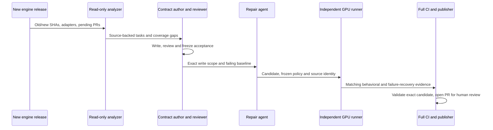
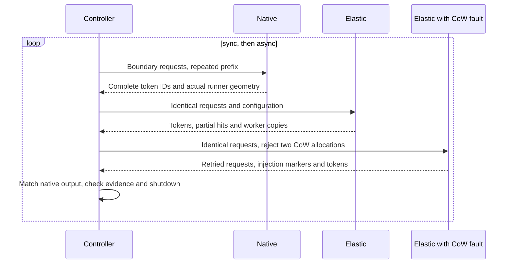

# Engine release compatibility workflow

This workflow detects stable vLLM and SGLang releases, prepares a bounded compatibility
repair, validates it on a separate GPU host, and publishes a PR for human review.
It does not merge changes or certify every supported model and GPU topology.

## Execution flow

1. An hourly poll selects the oldest unseen stable release at or above the
   configured starting version. Manual dispatch can select an exact tag.
2. The detector pins the upstream commit and claims the engine/release/profile pair in a tracker
   issue. Successful, failed, interrupted and no-change runs remain recorded.
   The candidate starts at the PR target's pinned default branch, not the branch
   used to dispatch the controller workflow.
3. For `auto`, a read-only Codex analysis compares the preceding stable release,
   the new release, current adapters and pending adapter PRs. It produces a
   coverage report and source-backed repair tasks. A separate invocation writes
   CPU/GPU acceptance tests, and another reviews those tests before they are
   frozen. No person needs to prepare a gap list or a version-specific profile.
4. A CPU job runs immutable behavioral probes and, when needed, invokes the
   bounded repair runner. Passing CPU probes still produces a candidate for GPU
   validation; it is not a reason to skip that stage.
5. A dedicated GPU runner independently reconstructs the candidate, builds it,
   and runs the GPU probe. It has no Codex credentials.
6. A behavioral GPU failure can trigger one additional CPU/GPU round. The CPU
   job verifies that the report belongs to this candidate and upstream commit.
   Infrastructure failures stop the run instead of asking the agent to fix code.
7. A passing candidate runs the complete CPU suite, MyPy on Python 3.9 through
   3.13, pre-commit, and GPU-free C++ tests in fresh hosted workers.
8. A separate publisher reconstructs exactly the tested commit and creates a PR.
   Existing human branch changes are never overwritten. Unchanged candidates
   produce a successful report without an empty PR. Publication is complete only
   after the PR identity, mergeability and remote checks for that SHA are verified.

Each CPU round permits one Codex attempt. There are at most two CPU/GPU rounds.
Manual dispatch defaults to `mode=validate`: run the independent checks against
the unchanged baseline, then GPU checks and full CI. The `auto` profile still
uses Codex for analysis and contract design, but validate mode never invokes a
repair agent, retries a behavioral failure or publishes a PR. Fixed profiles
do not invoke Codex at all in validate mode.
Use it to qualify merged adapters without duplicating pending manual work.
Scheduled runs retain the bounded `repair` mode; enabling schedules is a separate
operator decision, not a side effect of running validation.
GitHub's rerun button is deliberately disabled for this workflow: start a new
manual dispatch with a tag and `retry=true` to obtain a new explicit budget.
An interrupted claim is retained until that explicit retry; polling does not
silently spend another repair budget.

The next hourly poll discovers releases missed while another run was executing.
The `release` event on this repository cannot observe releases in the separate
engine repositories, so it is not used here. Detection latency is up to one
poll interval plus runner queue time; this is not an instantaneous webhook.



## Automatic analysis boundary

`engine-release-schedule.yml` polls both engines; `vllm-release-compat.yml`
retains its filename for existing dispatch links and runs either engine.
Scheduled runs always select `auto`. The preceding release is a source-diff
baseline, not a claim that the preceding release passed validation. Analysis
also audits current adapters, so the diff is not the only evidence it receives.
Engine reference checkouts materialize Git symlinks as inert text, without
following them outside the pinned source tree. Local replays should likewise use
`git -c core.symlinks=false clone ...` for their reference checkouts.

The analyzer covers startup, cache layout, scheduling, distributed behavior and
public API changes. It distinguishes adapter repairs, native upstream blockers
and work covered by pending PRs. Each repair cites exact source lines and defines
behavioral acceptance. At most eight tasks and sixteen exact write paths are
accepted per run. Only Python adapter/core files and focused tests are writable;
the controller adds the CPU test manifest when new test files need registration.
Native/CUDA changes and multi-GPU tasks are reported as blocked instead of being
silently reduced to a single-GPU test. Pending or blocked areas remain visible
even if a focused repair passes; that run does not close whole-release acceptance.

The contract author and reviewer see the unfixed baseline, not a repair diff.
The repair agent cannot edit the generated contract bundle, which is kept outside
the candidate and hash-bound through every job. A discovered repair requires a
behavioral baseline failure: import errors, skipped tests and an already-green
test are not evidence that the problem was reproduced. Existing controller
regressions and full repository CI remain mandatory.

### Interrupted analysis

Read-only analysis, contract authoring and contract review each have a 30-minute
work allowance, a 10-minute no-progress limit and a 45-minute absolute wall limit.
An observed CLI reconnect can exclude at most five minutes cumulatively from the
work/no-progress clocks. That interval ends at the next structured agent item;
it is a conservative recovery allowance, not a measurement of network latency.
Repeated retry messages and arbitrary stderr do not reset the progress clock.
The CLI retries transport failures inside its existing session; the controller
does not restart a new analysis on every disconnect.

Each attempt records its log, session ID, exit status, timeout reason and activity
accounting. The controller kills its owned process tree at a deadline. A timeout
is an incomplete stage, not a failed adapter assertion or successful acceptance.

For a stopped local run, invoke the same analysis command with `--resume` and the
same output directory. Completed stages are reused only if the sources, upstream
stage outputs, prompts, schemas and controller implementation still match their
checkpoint identities. Interrupted stages continue the recorded session ID,
never `--last`; ordinary failures and rejected reviews are not retried this way.
The same local Codex session store must still exist. Do not copy authentication
or restore sessions from untrusted artifacts. A fresh Actions runner does not
automatically acquire a previous runner's sessions.

Changed inputs require a fresh run. A leftover stage lock requires confirming
the original process tree has exited before removing that specific lock; the
controller never steals it. Every explicit resumed invocation has the same
bounded budgets and preserves earlier attempts. Repair and GPU validation gates
are unchanged; analysis recovery cannot turn an incomplete test bundle into a pass.

Generated tests are executable code. Their independent AI review is a guard, not
a security sandbox or a proof of coverage. Run CPU jobs on disposable workers
and GPU checks in credential-free containers. Do not expose a developer home,
SSH credentials or a Docker socket to candidate/test execution. Publication
credentials are confined to the publisher. The resulting PR still needs human
review. Native issue duplication beyond the supplied pending adapter PR snapshot
may require a follow-up audit before submitting a separate engine-repository PR.

vLLM retains the mandatory native/elastic tiny-attention comparison and CUDA
allocation/recovery probe in addition to the generated GPU contracts. SGLang
uses generated installed-engine contracts plus a mandatory runtime/CUDA recovery
control; this is not an assertion that its model-serving coverage equals the
existing vLLM profile matrix. Serving-related tasks must provide their own
native/elastic complete-output comparisons, checked by the contract reviewer.

## Enable the workflow

Enable only after an operator has validated the chosen execution environments.
No registration, credential copying or upstream setting changes happen merely
by merging these files.

| Setting | Purpose |
| --- | --- |
| `ENGINE_RELEASE_COMPAT_ENABLED` | Set to `true` to enable both engine scans. Unset by default. Legacy `VLLM_RELEASE_COMPAT_ENABLED` enables vLLM only. |
| `ENGINE_RELEASE_TRACKER_ISSUE` | Dedicated tracker issue; falls back to `VLLM_RELEASE_TRACKER_ISSUE`. |
| `VLLM_COMPAT_FIRST_VERSION` | Oldest release to process; defaults to `0.28.0`. |
| `SGLANG_COMPAT_FIRST_VERSION` | Oldest SGLang release to process; defaults to `0.5.15`. |
| `ENGINE_COMPAT_PUBLISH_REPOSITORY` | Branch destination, normally an automation fork; falls back to `VLLM_COMPAT_PUBLISH_REPOSITORY`. |
| `ENGINE_COMPAT_PR_REPOSITORY` | PR target; falls back to `VLLM_COMPAT_PR_REPOSITORY`, then the workflow repository. |
| `VLLM_COMPAT_IMAGE` | Optional operator-maintained runtime image; its installed vLLM version must match the selected release. |
| `SGLANG_COMPAT_IMAGE` | Optional exact-version SGLang runtime image. |
| `ENGINE_COMPAT_CODEX_API_KEY` | Secret used only for CPU-side analysis and repair. |
| `ENGINE_COMPAT_PUBLISH_TOKEN` | Dedicated publication credential, never supplied to candidate execution. |

The tracker issue body must contain this exact marker:

```text
<!-- kvcached-vllm-release-tracker -->
```

Use a token that can update the selected fork and open the target PR. The normal
workflow `GITHUB_TOKEN` is intentionally not used for publication: its generated
events do not generally start another workflow. Keep the published PR's normal
CI and review requirements enabled. The pipeline performs the full applicable
validation before publication; remote PR checks still confirm the published SHA.
If the target branch advances during validation, the publisher stops and asks
for a new validated run rather than silently rebasing the candidate.

Register an isolated Linux x64 GPU runner with the `engine-compat-gpu` label.
It needs Python 3.9+, Git, Docker with GPU support and a compatible host driver.
Do not register a shared production inference host or a developer's everyday
workstation under that label. A dedicated/ephemeral runner is the intended
deployment, and it must be able to reach GitHub and obtain the runtime image.

Default images are `vllm/vllm-openai:<release-tag>` and
`lmsysorg/sglang:<release-tag>`; the resolved image ID is
recorded for the run. Missing images, incompatible drivers and occupied GPUs are
infrastructure failures. A custom image is useful for an approved CUDA variant,
but does not allow testing one vLLM version while reporting another.

## Select a bounded task

Manual dispatch accepts `auto` or a reviewed fixed `profile`; scheduled runs use `auto`.
The task text, exact write allowlist and independent checks are owned by the
controller revision, not supplied by an issue comment or the repair agent.

| Profile | Repair scope | Independent acceptance |
| --- | --- | --- |
| `auto` | Derived from release analysis, then independently checked | Frozen generated CPU/GPU contracts, existing regressions and the engine's mandatory runtime probe |
| `vllm` | Worker profiling and warmup | Memory-contract tests, matched single-GPU output and CUDA OOM recovery |
| `native-layout` | Native 0.29 MRV2 allocator and views | Installed-engine view tests, then the single-GPU probe |
| `allocation` | 0.29 scheduling-miss translation and block lifetimes | CPU failure/ownership contracts, installed-engine block-pool tests, then the single-GPU probe |
| `attention-v1-028` | Validation only, no repair | 0.28 worker contracts and native/patched tiny attention outputs; V1, both elastic layouts |
| `attention-v2-028` | Validation only, no repair | Same narrow attention checks; explicitly selected and verified V2, both elastic layouts |
| `hybrid-v1-028` | Validation only, no repair | 0.28 V1 tiny dense hybrid, partial-prefix state copying and two real CoW allocation misses; sync and async |
| `hybrid-v2-029` | Validation only, no repair | The same hybrid acceptance with the 0.29 MRV2 runner |
| `sharing-v2-029` | Validation only, no repair | Tiny Gemma4 cross-layer KV sharing with 0.29 MRV2; matched native/elastic controls in both layouts |
| `gptoss-v2-029` | Validation only, no repair | Tiny FP16 GPT-OSS sliding/full attention and MoE on 0.29 MRV2 |
| `mla-v2-029` | Validation only, no repair | Tiny pre-V4 DeepSeek MLA on 0.29 MRV2; requires a working native MLA prefill backend |

For example, `--profile native-layout` selects the same scope in local CPU,
GPU and publication stages. Each stage verifies the profile name and a digest
of its policy, trusted tests, probe helpers and model fixture. Evidence from another task or an older
policy cannot authorize a retry or publication. Nondefault profiles publish to
separate task-suffixed branches. The tracker keeps separate records per release
and profile: a profiling pass must not suppress layout or allocation checks.
Historical records without a profile belong only to `vllm`. Only rerunning the
same release/profile requires `retry=true`; another profile gets its own claim.
Changing the candidate baseline still requires an explicit retry of that pair.

The fixed native profiles currently require a 0.29 release. A different release is
rejected before claiming it or spending a repair attempt; its trusted contracts
must first be updated by a reviewed controller change. The repair agent cannot
make an incompatible immutable test pass by editing the candidate's copy.
The automatic profile has no fixed version matrix: it derives a new bounded
task/contract bundle from the selected release instead.

For local automatic replay, use clean, separate checkouts pinned to the public
candidate base and both release tags. Supply an automatically collected JSON
snapshot of pending adapter PRs, not a hand-written task:

```bash
python tools/engine_release_analysis.py --engine vllm \
  --source /work/candidate --old-engine /work/vllm-old --engine-source /work/vllm-new \
  --old-tag v0.28.0 --tag v0.29.0 --pending-prs /work/pending-prs.json \
  --output /work/analysis
export ENGINE_COMPAT_ANALYSIS_DIR=/work/analysis/bundle
export ENGINE_COMPAT_ANALYSIS_DIGEST="$(python -c 'import json; print(json.load(open("/work/analysis/result.json"))["digest"])')"
```

Then use `--profile auto` with the CPU/GPU replay commands below. These environment
variables must point to the same immutable bundle at every stage; remote paths
may differ, but the digest must not. Local Codex authentication stays local when
the GPU stage is transported to a separate host.

Each required test file runs in an independent pytest process. The evidence
records its command, exit status, test count, failures, errors and skips. Empty
collection, a skipped contract, or an unavailable engine is `blocked`, not a pass.
Candidate tests are additional regression checks; they cannot replace the
controller's tests. An exit-zero GPU command without the matching independent
contract report is also rejected. The runtime verifies the actual loaded runner,
the activated elastic layout, and complete native/patched output token IDs.
Every configured layout must produce a matching result in `runtime/probe/matrix.json`.
A receipt from a different candidate, version, runner or policy cannot pass.

These are single-GPU contract profiles, not full release qualifications.
There are no selectable `tp2` or `pp2` profiles yet: their independent fault
assertions and hardware selection must be reviewed first. Unknown profiles stop
before repair. In particular, a tiny Llama result does not qualify Qwen/Mamba,
and a tiny hybrid result does not qualify full models, cross-layer Gemma, multimodal execution or
distributed unmap. Add a task-specific failing regression before asking the
agent to repair a newly discovered contract; these profiles do not infer tests
or acceptance requirements from a prompt.

### First 0.28 validation

After the shared profiling, packed storage and runner adapters have landed,
dispatch `tag=v0.28.0`, `mode=validate`, first with `attention-v1-028` and then
with `attention-v2-028`. Each runs both contiguous and non-contiguous storage.
For an isolated pre-merge check, the local `cpu --mode validate` stage accepts
an explicitly pinned integration commit as `--base`; it must be clean and is
never rewritten or published. The hosted workflow always pins the target default
branch and does not silently compose unmerged PRs.

Passing these profiles is only the attention smoke-test portion of #490/#509.
The following release gates are still separate, not implicitly green:

- Full-model Qwen hybrid/Mamba, eviction and cancellation beyond the tiny profiles below.
- Real image inputs and any configured multimodal GPU reservation backend.
- Ordered asynchronous physical release with the lifetime fix included.
- TP=2 and PP=2 failure/recovery on two physical GPUs.
- Matched full-model correctness and performance against native vLLM.

Do not start a 0.29 repair by interpreting a 0.28 attention pass as completion
of those gates. Record the accepted model/runner/backend/topology explicitly.

### Tiny cross-layer sharing validation

Use `sharing-v2-029` with `v0.29.0` in `mode=validate`. The offline fixture has
four layers: full and sliding attention owners with different head dimensions,
and two borrowers. It checks the actual owner/borrower Tensor pointers, shapes,
strides and dtypes after binding, then compares 28 completed requests / 896 output
tokens between native and elastic execution. Logprobs must be finite and the fixture
must not degenerate to the same token across every completion. Repeated prompts cross sliding-window
and block boundaries; both modes must explicitly shut down.

The native control and elastic run explicitly select the same `LBNHC` or `BLNHC`
layout. Both cells are required: a native backend failure is not automatically a
KVCached regression, but it cannot make the cell pass or justify silently dropping
that layout. Keep the two stage logs/results when assigning the failure to an
upstream task. This profile cannot authorize an agent repair.

The shared supervisor also checks source fingerprints, exact version/runner,
bounded child exits and a real oversized CUDA allocation followed by recovery.
The fixed-seed small random checkpoint is generated locally using the model's own
initializer rather than dummy-loaded parameters. This is synchronous, eager, FP16,
TP=PP=1 testing, not full Gemma
checkpoint quality, multimodal, FP8, async lifetime, distributed map/unmap chaos or
performance qualification.

### GPT-OSS and MLA model-path validation

Use `gptoss-v2-029` or `mla-v2-029` with `v0.29.0` in validation mode.
Both require matched native and elastic runs in `LBNHC` and `BLNHC`.
The offline fixed-seed FP16 checkpoints retain four GPT-OSS MoE layers with
alternating sliding/full attention, or two DeepSeek-V2 MLA layers with
512 latent and 64 RoPE elements. The MLA fixture uses dense FFNs, not MoE.

Each stage completes 42 requests and 1,344 tokens across block/window
boundaries, repeated prompts and prefix reset. The last elastic round injects
two allocator admission misses after reset; both must be hit, allocations
must recover, and all tokens must match the native control. This is not a
distributed TP/PP map-failure or lost-response test. Cache types, actual runner,
backend, layout, finite logprobs and explicit shutdown are checked too.

Native backend failure remains a failed gate, never a skipped success. For
example, T4 can run the GPT-OSS FP16 Triton path, but the tested 0.29 MLA prefill
path invokes FlashAttention, which requires Ampere or newer hardware. Do not
disable MLA or substitute an attention backend to claim that model passed.
These checks do not qualify full checkpoints, MXFP4/FP8, multimodal inputs,
async scheduling, TP/PP, MPS or performance.

### Tiny hybrid and partial-prefix validation

After composing the required adapters, use `hybrid-v1-028` with `v0.28.0`, then
`hybrid-v2-029` with `v0.29.0`, both in `mode=validate`. These profiles reject
repair mode, other release/runner pairs and contiguous storage. They do not
download weights: the controller supplies a four-layer dense hybrid config,
and vLLM initializes deterministic dummy weights. Execution is eager FP16 with
one GPU, one worker, no image inputs and a 16-token prefix hash unit.

For each scheduling mode, the probe runs fresh native, elastic and injected
engines. Requests straddle the observed recurrent allocation-block boundary,
which must be larger than the hash unit. Each case must finish all 24 requests
and 768 output tokens; elastic and injected results must match every native
token. A successful request alone is insufficient: durable markers must confirm
a real partial-prefix hit, worker state copy, and exactly two allocation misses
inside that partial-hit path in the injected case. The engine must explicitly
shut down and its child process must exit within the timeout.
The default per-child budget is ten minutes, including cold Triton/FLA kernel
compilation; the GPU stage also retains its overall 40-minute supervisor limit.
Timeouts are recorded as blocked, never converted into passing evidence.



The hooks are loaded only in the probe's child processes through a temporary
`sitecustomize.py`; neither the candidate nor a serving installation is edited.
Worker evidence uses a registered string-method RPC, without enabling unsafe
serialization. The copied model config must match the controller's fixture
digest, and candidate source fingerprints must remain unchanged. Missing
markers, wrong identities, unexpected tracebacks or CUDA errors cannot pass.

This proves a narrow dense hybrid/partial-prefix path, not full-size FP8 model
quality, multimodal inference, TP/PP, MPS, performance, allocator transaction
rollback or complete asynchronous page-retirement coverage. Those remain
separate release gates. Local replay also does not establish that a hosted
Action's authentication or runner registration has been configured.

## CPU and GPU separation

Codex calls its model service from the CPU execution host. The GPU host only
receives source, the immutable check program and the selected release. It does
not need to install or log in to Codex. Use a legally supported and reachable
Codex execution environment; changing authentication methods is not a remedy
for service access restrictions.

For local development, run the CPU stage on a machine where Codex is already
usable and provide `--gpu-command` to the GPU stage. This option accepts an
operator-owned JSON argv array, not a shell command from an issue or a candidate.
It receives `ENGINE_COMPAT_SOURCE`, `ENGINE_COMPAT_OUTPUT` and
`ENGINE_COMPAT_VERSION`, `ENGINE_COMPAT_PROFILE` and `ENGINE_COMPAT_POLICY_DIGEST`.
Run the selected controller checks on the remote runtime and return their
`checks.json` to `runtime/contracts/checks.json` beneath the output directory.
Also run the controller's `engine_compat_profile.py PROFILE --probe --source ...
--output ... --tag vX.Y.Z --candidate-sha SHA` and return its complete probe
directory under `runtime/probe/`. A generic tiny-model result alone is insufficient.
Return 0 for success, 1 for a behavioral failure, and 2
or another nonzero code for an infrastructure failure. The command must use a
bounded remote timeout and clean up its own processes. It is deliberately not
an input accepted by the public workflow.

Run `python tools/engine_compat_stage.py --help` for stage arguments. Both local
and Actions handoffs use the same `candidate.json` envelope and reconstruction
checks. Local replay verifies those stages, but is not evidence that a hosted
Action's authentication and runner configuration have been exercised.

## Trust and validation boundaries

- The controller, allowlist and GPU probes come from the workflow revision,
  never from the generated candidate. Check and candidate directories are separate.
- Only exact paths in the selected `.github/engine-compat/<profile>-allow.json`
  may change. Profiles cover bounded Python adapter contracts;
  unsupported C++, dependency or workflow changes require a human-owned task.
- The envelope records the original base, tag, file bytes, executable modes and
  reconstructed commit SHA. Every receiving job validates it again. The fixed
  automation commit identity/date makes reconstruction deterministic; original
  contributor commits are not rewritten.
- After CPU CI, the controller verifies HEAD, the index tree and actual tracked
  file contents/modes against that envelope. A clean `git status` alone is not
  accepted as proof that validation left the candidate unchanged.
- Hashes detect transfer errors and accidental candidate changes. They are not
  authentication on their own. Actions downloads artifacts by exact name from
  the current run; never accept an arbitrary public artifact URL as evidence.
- GPU source and check mounts are read-only. Only runtime results are writable;
  the candidate cannot modify the supervisor's handoff or success/failure report.
- Candidate execution has no publishing credentials. The publisher does not
  execute candidate code. Allowlist checks are not an OS sandbox; dedicated
  disposable runners and normal human review remain necessary.
- The attention single-GPU probe covers a small deterministic model and CUDA allocation
  failure/recovery, verifies a partially mapped virtual KV pool, and explicitly
  shuts down the embedded engine. It cannot establish TP/PP, MPS, hybrid/Mamba, multimodal,
  multi-instance fairness or large-model performance. Those remain explicit
  additional acceptance gates for relevant changes.

## Relationship to engine-fork synchronization

The bounded repair component is described in [ENGINE_COMPAT_REPAIR.md](ENGINE_COMPAT_REPAIR.md).
The separate engine-fork synchronization proposal (#423) maintains downstream
vLLM/SGLang patch stacks. It is useful when such a fork is the deployment target,
but synchronizing a fork is not required merely to select an official release.

This workflow targets the pinned official vLLM release and adapts KVCached. It
does not silently rebase or publish an engine fork as a side effect. If a maintained
engine fork is selected later, its prepared commit and matching runtime must be
passed through the same checks before a compatibility result is claimed.
