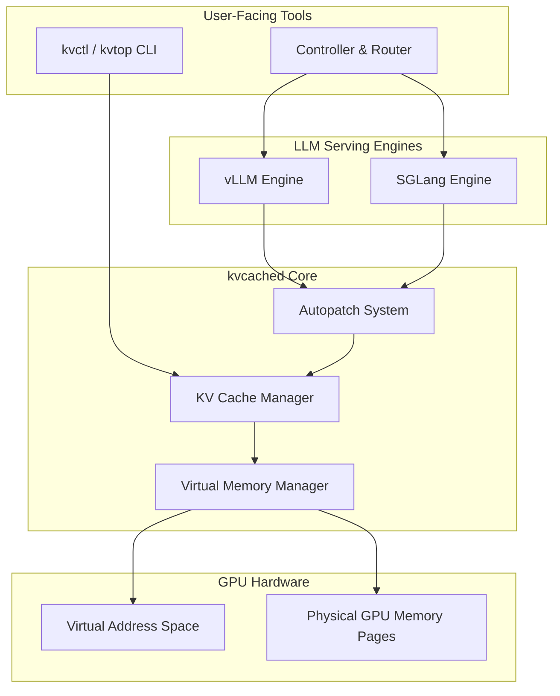
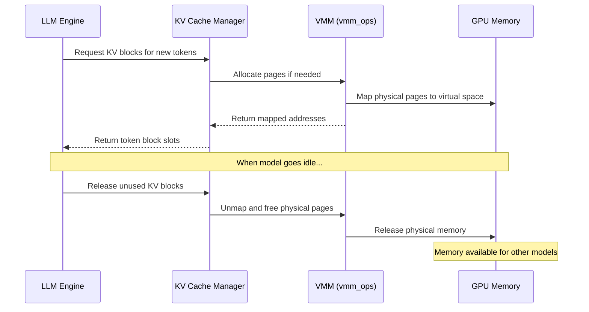

# Architecture

## Overview

kvcached operates as a **shim layer** between LLM serving engines (vLLM, SGLang) and GPU physical memory. It implements GPU memory ballooning—a concept borrowed from virtual machine hypervisors—to enable elastic, demand-driven memory sharing across multiple LLM instances.

## System Layers

## Core Design Principles

### 1. Memory-Centric Unification

kvcached's central insight is that **GPU memory is the unifying bottleneck** in multi-LLM serving. Both time-sharing (swapping models in/out) and space-sharing (colocating models) are fundamentally about memory management:

- **Time-sharing** focuses on efficiently swapping LLM weights
- **Space-sharing** determines how to scale KV cache capacity among concurrent models

By treating GPU memory as an elastic resource via ballooning, kvcached can fluidly shift between sharing modes and even enable both simultaneously.

### 2. Virtual/Physical Memory Decoupling

Like a CPU operating system's virtual memory, kvcached decouples virtual address spaces from physical memory:

- **Virtual memory**: Each engine reserves a large contiguous virtual address space at startup (cheap, no physical cost)
- **Physical memory**: 2MB GPU memory pages are allocated on demand and mapped to virtual addresses lazily

This enables memory to expand and shrink as workloads change without engine restarts or code modifications.

### 3. Transparent Integration

kvcached requires **zero changes** to serving engine code or attention kernels. It achieves this through:

- The **Autopatch System** that dynamically replaces memory management functions at import time
- The **Elastic Tensor (eTensor)** abstraction that behaves identically to regular PyTorch tensors

## Component Architecture

### Autopatch System

The autopatch system is the entry point for kvcached integration. When `KVCACHED_AUTOPATCH=1` is set, kvcached intercepts engine imports and replaces standard memory managers with elastic versions.

Key responsibilities:

- Detect the serving engine (vLLM or SGLang) and its version
- Apply version-specific patches to memory management modules
- Replace static block pool allocators with elastic counterparts

### KV Cache Manager

The KV cache manager maps application-level semantics (token blocks, layers, attention heads) to physical memory pages:

- Maps token blocks onto underlying virtual and physical GPU pages
- Segregates token blocks from different models onto distinct memory pages
- Handles the diversity of KV cache layouts across model architectures (different head dimensions, layer counts)

### Virtual Memory Manager (vmm_ops)

The low-level C++ extension that interfaces with CUDA Virtual Memory Management APIs:

- Reserves virtual address spaces via `cuMemAddressReserve`
- Allocates physical pages via `cuMemCreate`
- Maps/unmaps physical pages to virtual addresses via `cuMemMap`/`cuMemUnmap`
- Manages a pre-allocation buffer for fast page provisioning

### Controller & Router

The multi-model serving control plane:

- **Frontend Router**: OpenAI-compatible HTTP server that routes requests to backend engines by model name
- **Sleep Manager**: Puts idle models to sleep (releases physical memory) and wakes them on demand
- **Traffic Monitor**: Tracks per-model request rates and idle times for scheduling decisions

## Memory Flow

## Relation to Prism

kvcached is the **balloon driver** component of the Prism system (OSDI 2026). Prism is a memory-centric GPU sharing framework for cost-efficient multi-LLM serving that additionally includes:

- **Load-Aware Model Placement**: A global scheduler that places models across GPUs to minimize KV pressure ratio (KVPR)
- **Slack-Aware Request Arbitration**: A local scheduler that prioritizes requests based on their time slack relative to SLO deadlines

While Prism provides the full scheduling stack, kvcached can be used independently as an elastic memory management library for any multi-model GPU sharing scenario.

## Further Reading

- [GPU Virtual Memory](virtual-memory.md) — Deep dive into the virtual memory mechanism
- [Autopatch System](autopatch.md) — How engine integration works without code changes
- [Prism Paper](https://arxiv.org/abs/2505.04021) — The full system design and evaluation
