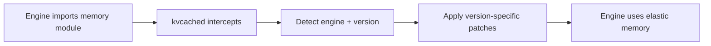

# Autopatch System

## Overview

The autopatch system is kvcached's mechanism for **transparently integrating** with LLM serving engines without requiring any code modifications to vLLM or SGLang.

When `KVCACHED_AUTOPATCH=1` is set, kvcached automatically intercepts engine module imports and replaces standard memory management components with elastic versions.

## How It Works

### 1. Activation via .pth File

kvcached installs a `kvcached_autopatch.pth` file into Python's `site-packages`. This file is executed automatically by Python at startup (before any user code runs), registering kvcached's import hooks.

### 2. Import Interception

When the serving engine imports its memory management modules, kvcached intercepts these imports and applies patches:



### 3. Version-Aware Patching

kvcached maintains patches for multiple engine versions:

| Engine | Supported Versions | Patched Components |
|--------|-------------------|-------------------|
| vLLM | v0.8.4 – v0.19.0 | elastic_block_pool, engine_core, gpu_model_runner, gpu_worker, kv_cache_coordinator |
| SGLang | v0.4.9 – v0.5.10 | memory_pool, scheduler, token_manager |

## Patch Architecture

Each patch follows a common structure defined in `patch_base.py`:

1. **Detection**: Identify the engine and its exact version
2. **Module replacement**: Replace specific classes or functions with elastic equivalents
3. **Validation**: Verify patches were applied successfully

## Enabling/Disabling

```bash
# Enable kvcached
export ENABLE_KVCACHED=true
export KVCACHED_AUTOPATCH=1

# Disable (use standard engine memory management)
unset ENABLE_KVCACHED
unset KVCACHED_AUTOPATCH
```

When disabled, engines operate exactly as they would without kvcached installed.

## Verification

When patches are applied successfully, you'll see log messages:

```
[kvcached][INFO] Applying 6 patches for vllm
[kvcached][INFO] Detected vllm version: 0.19.0
[kvcached][INFO] Successfully patched vllm: elastic_block_pool, engine_core, gpu_model_runner, gpu_worker, kv_cache_coordinator
```

## Further Reading

- [Architecture](architecture.md) — Overall system design
- [Build System](../development/build-system.md) — How the .pth file is installed
